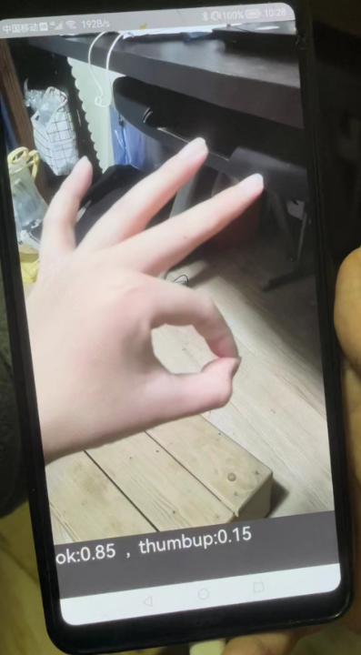
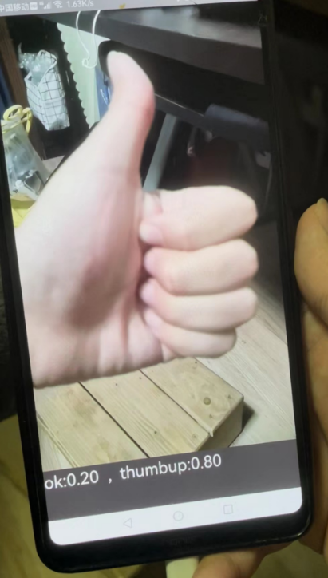

# 基于MindSpore的手势识别

### 简介

使用MobileNet作为backbone，实现手机端手势识别算法，并使用MindSporeLite在端侧推理部署。能够打开摄像头，实时识别手势。

目前仅支持两类手势：ok和thumbup，如下所示

            

### 环境

操作系统：windows10

python3.7.5

mindspore1.6.1

mindvision0.1.0

### 代码说明

handpose_model：模型训练的代码。使用预训练MobileNet在手势数据集上微调得到。

handpose：安卓app代码

### 增加其他手势

虽然本项目仅支持两种手势，但可以经过简单修改，轻松扩展到支持多个手势。

增加其他手势的流程如下：

1.在handpose_model文件夹下训练模型

- 在dataset文件夹中准备数据集
- 针对自己的需求，对mindspore_train.py做一定修改
- 执行mindspore_train.py进行模型训练，生成mobilenet_v2_1.0_224.mindir和best.cpkt
- 将convert.bat中的各种路径设置为自己的路径
- 执行convert.bat，得到mobilenet_handpose.ms

2.在handpose文件夹下搞安卓app

- android studio打开handpose文件夹
- 将生成的mobilenet_handpose.ms粘贴到handpose\app\src\main\assets下
- 若手势类别不是2类了，则需要在代码中做一定修改
- 编译、执行项目，在手机上查看效果

### 参考

本作业参考了一篇博客（参考了其模型训练、模型转换的部分）

https://blog.csdn.net/qq_40918859/article/details/125105637

以及Mindspore官方的图像分割的示例（参考了其读取ms模型并执行推理的部分，以及处理输入图像的部分）：

https://gitee.com/mindspore/models/tree/master/official/lite/image_segmentation

以及其他一些互联网资料。

